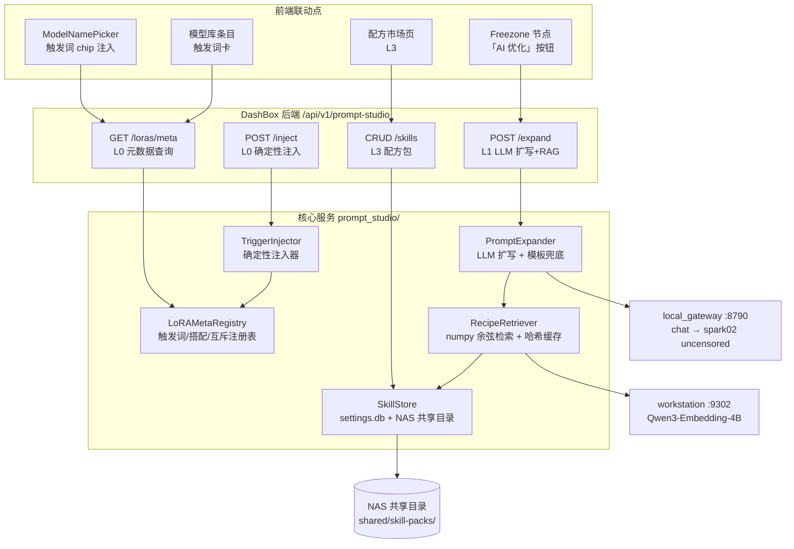

# RFC：DashBox 提示词优化系统（确定性配方 + LLM 扩写 + RAG + Skill 市场）

| 字段 | 值 |
|---|---|
| 状态 | **v3 定稿**（2026-08-17 用户全部接受：v2 三条修正 + 三项开放问题决策） |
| 日期 | 2026-08-17 |
| 作者 | 设备管家（AI） |
| 影响面 | DashBox 后端新模块 + local_gateway + 前端三处联动 + NAS 共享目录 + 下载管线 |
| 关联文档 | [nsfw-video-generation.md](../guides/nsfw-video-generation.md)（触发词/配方数据来源） |
| 硬约束 | **全本地 + NSFW 兼容**（仅此两条；允许引入任何可本地自托管的新组件/服务，评估标准为本地可行性与合规，而非"是否已部署"） |
| 变更记录 | v1 初稿 → v2（L0 自动建卡 / L2 可裁剪 / G6 出片门禁 / 约束放宽）→ **v3（开放问题 Q2-Q4 全部决策，定稿）** |

---

## 1. 概述

为 DashBox 增加提示词优化能力：用户给出一句种子描述，系统产出可直接提交的引擎原生提示词（含触发词、负面词、采样参数建议）。核心设计立场：**触发词与 LoRA 搭配是确定性知识，不交给 LLM 自由发挥；LLM 只做语言扩写；RAG 只为 LLM 提供"像爆款"的上下文**。系统分四层落地（L0 配方层 → L1 扩写层 → L2 检索层 → L3 市场层），每层独立可用、独立验收。

## 2. 背景与调研结论

### 2.1 痛点

- Wan 2.2 / H3 NSFW 工作流要求精确的触发词（`m15510n4ry`/`hmmotion`…），写错=LoRA 白挂，且无任何报错（静默失效）
- 用户不知道该挂哪几个 LoRA、各挂多少强度、HIGH/LOW 侧如何分工
- 提示词质量直接决定产出质量，但作者配方散落在 Civitai 各页面，靠人肉抄

### 2.2 已有资产调研（关键结论）

| 资产 | 调研结论 | 复用策略 |
|---|---|---|
| spark02 qwen3.6-uncensored（local_gateway `POST /v1/chat/completions`，上游模型名 `qwen3.6-uncensored`） | uncensored 是 NSFW 提示词扩写的硬性前提，公共 LLM API 全部会拒写 | L1 扩写引擎，经 local_gateway 调用（不直连，统一超时/日志/鉴权） |
| Qwen3-Embedding-4B（workstation :9302，OpenAI 兼容 `/v1/embeddings`，2560d） | 已在为 cognee 服务，稳定性已验证 | L2 向量化引擎，HTTP 调用，DashBox 进程不加载模型 |
| **Civitai 版本元数据 API**（`GET /api/v1/model-versions/{id}`） | **`trainedWords` 字段即作者官方触发词**（DR34ML4Y 五姿势词、POV 五词实测在位）；版本名自带侧别信息（`HIGH v0.08a`/`V1 Low`/`LOW_V2`）；baseModel 即路由 | **L0 自动建卡的数据源**——下载管线落盘时自动采集，人工只精修强度/互斥/角色 |
| AICG M6 `rag_service.py` | 模式已实战验证：懒加载 + 内容哈希缓存失效 + top-k 检索 + system prompt 构建 + LoRA 推荐 + 输出解析/fallback | **搬模式不搬代码**（AICG 冻结，且其本地 fastembed 改为 HTTP 调 :9302） |
| AICG M6 六类 KB（styles/shots/negatives/examples/methods/genre_tropes，96K JSON） | 结构 `{id, category, domain, lang, title, content, tags, negative_terms, recommended_loras…}` 通用 | 数据直接迁移为 L2 首批语料 |
| AICG M21 `prompt_expander.py` | 「LLM 扩写 → 结构化 IR → 引擎编译 + 确定性模板兜底」是正确范式 | L1 采用同范式：LLM 失败/坏 JSON 时回退确定性拼接，不阻断生产 |
| 8 个 Civitai 作品逆向全参数 | 触发词/LoRA 搭配/采样参数/提示词全文齐备 | L0 配方层冷启动数据 + L2 语料 |
| DashBox cognee 内嵌向量设施 | 面向故事图谱，与提示词检索域不同 | 不复用，L2 用进程内 numpy 检索（见 §7 替代方案） |

### 2.3 上游 DramaClaw 对照

上游无提示词优化系统（其定位是通用生产线，提示词由用户/各节点自持）。本系统为 DashBox 本地化独有增强，不冲突、不需对齐。

## 3. 目标与非目标

### 目标

- G1：新模型**下载落盘即自动建卡**（Civitai `trainedWords` + 版本名侧别推断 + baseModel 路由），触发词自动可见、一键注入；人工只精修强度/互斥/角色
- G2：一句中文种子 → 一键生成引擎原生完整提示词（Wan 骨架 / H3 长描述 / SDXL 标签式），LLM 故障时确定性兜底
- G3：扩写时可检索"相似爆款配方"作为上下文（L2，**可裁剪**——语料规模不足时先用确定性配方选择器）
- G4：配方可创建/编辑/导入导出，经 NAS 共享目录在 DashBox/ToIV 间流通（L3）
- G5：全流程 TDD，回归基线不降级（当前 2333 pytest / 2293 vitest / tsc 0）
- G6（门禁）：**P0 之后、P1 之前必须完成端到端出片验证**——按教学文档手工跑通 ≥1 条 Wan NSFW 视频，确认「触发词+搭配+参数」配方本身正确，再投入自动化

### 非目标

- ✗ 不做公网 Skill 市场/上传社区（NSFW 合规 + 核心数据全本地原则）
- ✗ 不做提示词自动评分/A-B 竞技场（后续单独立项）
- ✗ 不改造既有生成链路（local_gateway 提交链、预检链只增不改）
- ✗ 不支持公共 LLM（OpenAI/Claude）作为扩写后端（NSFW 拒写 + 数据出界）
- ✗ 不做 LoRA 触发词的爬虫/训练侧自动挖掘（触发词只采信 Civitai 官方 `trainedWords` 与人工精修两个来源）

## 4. 总体架构

### 4.1 分层视图



### 4.2 各层职责与依赖

| 层 | 名称 | 职责 | 依赖 | 可独立交付 |
|---|---|---|---|---|
| L0 | 确定性配方层 | 下载管线自动建卡（trainedWords/侧别/路由）+ 人工精修 + 触发词注入 + 搭配/互斥校验 | Civitai 版本 API | ✅ |
| L1 | LLM 扩写层 | 种子 → IR → 引擎原生提示词 + 负面词；LLM 故障回退模板 | local_gateway chat | ✅（须先过 G6 门禁） |
| L2 | RAG 检索层（**可裁剪**） | 配方/作品/六类 KB 向量化检索，为 L1 供 few-shot；语料不足时由确定性配方选择器顶替 | :9302 + L3 数据 | ✅（可整体推迟） |
| L3 | Skill 市场层 | 配方包 CRUD/导入导出/NAS 共享流通 | settings.db + NAS | ✅ |

### 4.3 调用链（L1+L2 完整路径）

1. 前端提交 `{seed, route(wan22|h3|sdxl|krea2), selected_loras[], scene_hint}`
2. `TriggerInjector` 按 selected_loras 产出触发词序列 + 推荐强度 + 互斥警告（确定性）
3. `RecipeRetriever` 以 seed+scene_hint 检索 top-3 相似配方/作品（L2，失败静默跳过）
4. `PromptExpander` 组装 system prompt（路线模板 + 触发词 + 检索结果）→ local_gateway chat → spark02
5. 输出解析（json_repair）→ 结构化 `{positive, negative, params}`；任何一步失败 → 确定性模板拼接兜底，响应带 `degraded: true` 标记

## 5. 数据模型

### 5.1 LoRA 元数据卡（L0 核心：自动建卡 + 人工精修）

**两级来源**：
1. **自动建卡（主）**：`ModelDownloadService` 落盘完成时，用下载时的 `modelVersionId` 调 Civitai 版本 API 采集 → 生成元数据卡写入 settings.db（`prompt_studio.lora_meta.{file_name}`）。采集规则：
   - `trigger_words` ← `trainedWords`（作者官方，原样采信）
   - `side` ← 版本名/文件名正则（`HIGH|high[ _-]?noise`→high，`LOW|low[ _-]?noise`→low，否则 any）
   - `route` ← `baseModel` 映射（Wan Video 2.2→wan22，MiniMax H3→h3，SDXL→sdxl，Krea 2→krea2，未知→other）
   - `nsfw` ← `nsfwLevel>1` 或文件名关键词（复用 is_nsfw_name）
   - 采集失败（401/离线）→ 建空卡标记 `meta_incomplete: true`，列表页提示「缺触发词，去补录」
2. **人工精修（补）**：编辑器补 `strength/conflicts/role/notes`，存 `prompt_studio.lora_meta_overrides`（优先级高于自动卡）
3. **内置基线卡**：本批 22 项 + 库内既有 NSFW 项随版本预置（等效一份精修过的快照，兜底无网环境）

```jsonc
// 元数据卡结构（自动字段 + 精修字段并集）
{
  "id": "dr34ml4y-i2v-low-v2",
  "file_name": "DR34ML4Y_I2V_14B_LOW_V2.safetensors",  // 与模型库 name 精确匹配
  "display_name": "DR34ML4Y All-In-One LOW v2",
  "route": ["wan22"],
  "side": "low",                    // 自动：版本名/文件名正则推断
  "role": "pose_base",              // 精修：pose_base|action|body_part|style|speed|enhance
  "trigger_words": ["m15510n4ry", "d0gg1e", "c0wg1rl", "bl0wj0b", "d0ubl3_bj"],  // 自动：trainedWords
  "trigger_mode": "pick_one",       // 精修：pick_one|all|optional
  "strength": {"default": 0.9, "min": 0.5, "max": 1.0},  // 精修（默认 0.8）
  "conflicts": [],                  // 精修：互斥 lora id
  "nsfw": true,                     // 自动：nsfwLevel + 关键词
  "source": "civitai:2553271",      // 自动
  "meta_incomplete": false,
  "notes": "姿势触发词底座，几乎必挂"  // 精修
}
```

路线默认参数 `route_defaults`：wan22 = 6 步/CFG5/euler/simple/高低噪 50-50 分段；h3 = 6 步/res_multistep/simple/turbo_strength 1.0；sdxl = 28 步/CFG6.5/dpmpp_2m_sde/karras。

### 5.2 Skill Pack（L3 市场流通格式）

```jsonc
{
  "schema": "dashbox.skill-pack/v1",
  "id": "wan22-missionary-standard",
  "name": "Wan2.2 传教士标准配方",
  "route": "wan22",
  "nsfw": true,
  "loras": [                        // 有序 = 挂载顺序
    {"id": "wan-general-nsfw-high", "strength": 0.8},
    {"id": "m4crom4sti4-high", "strength": 0.8},
    {"id": "dr34ml4y-i2v-low-v2", "strength": 0.9},
    {"id": "lightx2v-4step-high", "strength": 1.0},
    {"id": "lightx2v-4step-low", "strength": 1.0}
  ],
  "prompt_skeleton": "{trigger}, {subject_action}, {gaze_camera}, {quality_tail}",
  "example_positive": "m15510n4ry, a woman is lying on her back …",
  "negative": "watermark, text, subtitles, …（完整模板串）",
  "params": {"steps": 6, "cfg": 5, "sampler": "euler", "scheduler": "simple",
             "width": 832, "height": 480, "length": 81, "fps": 16},
  "first_frame": {"route": "sdxl_nsfw", "checkpoint": "lustifySDXLNSFW_apexV8"},
  "tags": ["wan22", "missionary", "pov"],
  "author": "local",
  "created_at": "2026-08-17T00:00:00Z"
}
```

- 存储：用户私有的存 settings.db（`prompt_studio.skill_packs` JSON 键）；**共享的写 NAS `shared/skill-packs/*.json`**（DashBox/ToIV 双读双写，天然"市场"）
- 导入导出：单文件 JSON 下载/上传，导入时校验 schema + LoRA 文件在库检查（复用 preflight 的库扫描）

### 5.3 API 契约（DashBox 惯例 `{ok,data}` 信封 + get_api_user）

| 端点 | 方法 | 说明 |
|---|---|---|
| `/api/v1/prompt-studio/loras/meta?file_names=a,b` | GET | 按文件名批量取 L0 元数据（picker 联动） |
| `/api/v1/prompt-studio/inject` | POST | 入 `{route, lora_files[]}` → 出 `{trigger_words[], strengths, warnings[], route_defaults}` |
| `/api/v1/prompt-studio/expand` | POST | 入 `{seed, route, lora_files[], scene_hint?, use_rag}` → 出 `{positive, negative, params, degraded, rag_refs[]}` |
| `/api/v1/prompt-studio/skills` | GET/POST | 配方列表（本地+NAS 合并视图）/ 新建 |
| `/api/v1/prompt-studio/skills/{id}` | GET/PUT/DELETE | 单配方读写删 |
| `/api/v1/prompt-studio/skills/{id}/export` | GET | 下载 JSON |
| `/api/v1/prompt-studio/skills/import` | POST | 上传 JSON（schema 校验 + 在库检查报告） |

NSFW 门禁联动：`nsfw=true` 的元数据/配方在 R18 未开启时全部过滤（复用 `model_library.nsfw_status()`）。

## 6. 实施计划（分期，每期独立验收）

### P0 — L0 确定性配方层（自动建卡版，价值密度最高）

1. `prompt_studio/` 模块骨架 + 内置基线卡（本批 22 项 + 库内 NSFW 项）
2. **下载管线接自动建卡**：`ModelDownloadService` 落盘完成钩子 → Civitai 版本 API 采集（trainedWords/侧别正则/baseModel 路由/nsfwLevel）→ 写 settings.db；失败建 `meta_incomplete` 空卡不阻断下载
3. `TriggerInjector`：触发词 pick/互斥警告/路线默认参数
4. 端点 `/loras/meta` + `/inject`；R18 过滤
5. 前端：ModelNamePicker 选中 LoRA → 触发词 chips（点击复制）+ 互斥红警 + `meta_incomplete` 琥珀色「去补录」提示
6. TDD：采集解析/侧别正则/路由映射/失败空卡/覆盖优先级/端点契约/picker 联动 vitest

**验收**：新下载的 DR34ML4Y 落盘即带 5 个姿势触发词；互斥 blowjob 双选出红警；全量回归不降级

### G6 — 端到端出片验证门禁（P0 → P1 之间强制）

按教学文档手工配置一条 Wan 2.2 NSFW 工作流（高低噪双模型 + DR34ML4Y + 1 个动作 LoRA + lightx2v + 6 步/Euler/CFG5），经 LB :8188 实际出片 ≥1 条并人工确认质量达标（构图/动作/触发词生效）。**配方被证明正确之前，不投入 P1-L3 自动化**——避免把错误配方固化进系统。门禁产出：验证记录 + 配方参数修正（如有）回写基线卡。

### P1 — L1 LLM 扩写层（须过 G6）

1. `PromptExpander`：三条路线 system 模板（Wan 骨架/H3 长描述/SDXL 标签）+ json_repair 解析 + 确定性兜底
2. local_gateway chat 客户端（httpx，300s 超时，非流式），**复用 `DC-hermes-LLM` 逻辑模型（D4 已决，不新增网关模型）**
3. 端点 `/expand`；Freezone 文本/视频节点「AI 优化」按钮（写入节点 prompt 字段）
4. TDD：mock chat 成功/坏 JSON/超时三分支 + 兜底断言 + 前端按钮契约

**验收**：种子"女仆咖啡厅第一人称"→ 输出含 `hmmotion` 或路线触发词的完整正负提示词；chat 断连时 `degraded=true` 仍有可用输出

### P2 — L2 RAG 检索层（可裁剪：默认先用确定性配方选择器）

0. **默认实现 = 确定性配方选择器**：按 `route 匹配 + selected_loras 重叠度 + tags 命中` 打分选 top-3 配方作为 few-shot，零 embedding 依赖
1. （可选增强）`RecipeRetriever`：HTTP embeddings(:9302) + 进程内 numpy 余弦 + 内容哈希缓存（M6 模式）——**启用条件**：语料 >1000 条 或 确定性选择器实测召回不满意
2. 语料入库：M6 六类 KB（迁移）+ 8 作品配方 + 本教学文档切片 + P3 配方
3. `/expand` 接入 `use_rag`；响应带 `rag_refs` 溯源
4. TDD：选择器打分/检索排序/缓存失效/embedding 故障静默降级

**验收**：同种子开关 RAG 输出可区分；:9302 宕机不阻断 expand；确定性选择器版本验收标准相同

### P3 — L3 Skill 市场层

1. `SkillStore`：settings.db + NAS `shared/skill-packs/` 双源合并；**同名冲突按 mtime 新者胜（D2 已决）**，冲突时日志记录被覆盖方
2. 配方 CRUD/导入导出端点 + 前端「配方」页签（列表/详情/应用即填充工作流/导出）
3. **「一键存为配方」**：生成产物页/任务中心提供按钮，将当次工作流参数+提示词+LoRA 组合落成配方并自动进入 L2 检索语料（D3 已决）
4. NSFW 配方 R18 过滤；导入在库检查（复用 preflight）
5. TDD：CRUD/双源合并/冲突策略/导入校验/一键存配方/前端页签 vitest

**验收**：DashBox 建配方 → ToIV 侧 NAS 目录可见可用；导出 JSON 再导入幂等；同名旧配方被新配方覆盖且日志可查

## 7. 替代方案对比

> 评估标准（v2 更新）：硬约束仅**全本地 + NSFW 兼容**。允许引入任何可本地自托管的新组件；「是否已部署」不构成否决理由。

| 方案 | 优点 | 缺点 | 结论 |
|---|---|---|---|
| **纯 LLM 自由发挥**（无 L0） | 实现最简单 | 触发词靠模型记忆，`m15510n4ry` 这类编码词必错；错挂静默失效 | ✗ 触发词必须确定性 |
| **纯人工注册表**（v1 原案） | 数据精确 | 新模型入库即腐坏，维护责任悬而未决 | ✗ 已由「下载管线自动建卡」替代（trainedWords 官方数据源实测可用） |
| **确定性配方选择器**（P2 默认） | 零依赖、行为可解释、语料小时更稳 | 语料上千后召回粗糙 | ✅ P2 默认实现 |
| 本地 numpy 向量检索（P2 可选） | 语义召回好、M6 已验证 | 小语料收益存疑 | ⏸ 语料 >1000 或选择器不达标时启用 |
| Qdrant / 其他本地向量库 | 规模可扩展、本地自托管合规 | 当前数据量不必要；引入即增运维面 | 预留接口，规模驱动再迁 |
| 复用 cognee 向量库 | 零新代码 | 检索域混杂（故事图谱 vs 配方）、维度/索引不可控 | ✗ 职责分离 |
| 公共 LLM（OpenAI 等） | 质量上限高 | NSFW 拒写、数据出界、成本 | ✗ 硬性排除（违反双硬约束） |
| 公共 Skill 市场 | 生态最大 | NSFW 合规风险 + 违背全本地 | ✗ NAS 共享目录替代 |

## 8. 安全、隐私与性能

- **NSFW 合规**：元数据/配方带 `nsfw` 标志，R18 未开启全链路过滤（注册表/检索/市场三处）；配方不出本机与 NAS
- **熔断**：chat/embedding 调用超时 + 失败计数熔断（参考 rag_service 的 MODEL_LOAD_FAILURE_TTL 模式），故障时 L1 回退确定性模板、L2 静默跳过，**永不阻断生成交付**
- **性能**：注册表/配方均 <10KB 常驻内存；embedding 批量 32 条/次 + 内容哈希缓存，KB 变更才重算；`/expand` P95 目标 <15s（spark02 300s 上限内）
- **并发**：检索/注册表只读无锁；SkillStore 写入 threading.Lock（沿用 model_library 模式）

## 9. 监控与验收指标

- 日志：`prompt_studio` logger 记录 expand 耗时/rag 命中数/degraded 率（structlog 随主日志）
- 指标（日志计数即可，不引新组件）：`/expand` 调用数、degraded 率（目标 <5%）、RAG 命中率、互斥警告触发数
- 回归门禁：每期交付 = 新增测试全绿 + 全量 pytest/vitest/tsc 不降级 + 浏览器冒烟（picker chips / AI 优化按钮 / 市场页签）

## 10. 决策记录（全部已决，v3 定稿）

| # | 问题 | 决策 | 说明 |
|---|---|---|---|
| D1 | 触发词元数据维护责任 | **下载管线自动建卡 + 人工精修** | v2 已采纳：Civitai `trainedWords` + 侧别正则 + baseModel 路由；失败建 `meta_incomplete` 空卡提示补录 |
| D2 | NAS 同名配方冲突写策略 | **按 mtime 新者胜** | 双项目低并发场景可接受；被覆盖方写日志可查（P3 落地） |
| D3 | 成功案例是否入 RAG 语料 | **纳入（P3）** | 生成产物提供「一键存为配方」，自动进入 L2 检索语料，形成自用数据飞轮 |
| D4 | 是否注册专用逻辑模型 `DC-prompt-optimizer` | **不注册，复用 `DC-hermes-LLM`** | 减少 local_gateway 变更面；限速/统计靠 prompt_studio 自身日志计数 |
