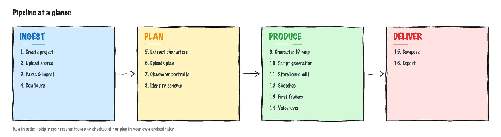

<div align="center">

<!-- TBD: 替换为正式 logo assets/logo.svg -->
<h1>DashBox</h1>

<p><strong>DashBox 是基于 <a href="https://github.com/dramaclaw/dramaclaw">DramaClaw CE</a>（Elastic License 2.0）的本地化二次开发版本。</strong></p>

## Make Your Own DC.

<p align="left">

他们说你过时了。<br/>
也许是「打工」这件事过时了。<br/>
<br/>
AI 时代，真正的问题不是机器会不会替代人。<br/>
真正的问题是：<br/>
谁拥有机器？<br/>
谁拥有流程？<br/>
谁拥有工业化生产力？<br/>
<br/>
如果答案永远是大厂，<br/>
那 AI 就不是平权。<br/>
那只是新的高墙。<br/>
<br/>
我是 Eric。<br/>
<br/>
这不是 demo。<br/>
不是玩具。<br/>
不是阉割版。<br/>
<br/>
这是一条我们团队自己每天在跑的漫剧工业化生产线。<br/>
从脚本到分镜，从资产到成片，全链路。<br/>
<br/>
因为人不是牛马。<br/>
因为创造力，是人类最后的防线。<br/>
<br/>
DashBox 要做的事很简单：<br/>
<br/>
<strong>拆墙。</strong><br/>
<br/>
把过去只有大厂才有的漫剧工业化能力，<br/>
交到普通创作者手里。<br/>
<br/>
代码已就位。<br/>
认同的话，留下一颗 ⭐。<br/>
我们继续拆。

</p>

<br/>

[](../LICENSE)
[](#quick-start)

[English](../README.md) &nbsp;|&nbsp; **简体中文** &nbsp;|&nbsp; [文档](../docs/zh/README.md) &nbsp;|&nbsp; [快速开始](../docs/zh/getting-started/quickstart.md)

</div>

<br/>

<p align="center">
  
</p>

<br/>

## DashBox 是什么？

DashBox 是一条**源码可见的漫剧工业化生产线**。丢进一本原稿，DashBox 会接管全部繁重工作：抽取角色、规划剧集、生成剧本、绘制分镜与首帧、合成配音、最终剪成成片。

它为创作者、独立工作室以及创意工程师而生 —— 让你在自己的基础设施上跑完整个「漫剧智造工厂」，不必再去拼接十几个割裂的工具，也不必把素材交给一个看不见内部的黑盒云服务。

而且，虽然以漫剧生产为核心，同一条流水线 —— 角色、资产、脚本、分镜、配音、合成 —— 同样能产出其它视觉内容形态：短视频广告、电商带货视频、互动乙游等。

<br/>

## 核心能力

- **小说解析与故事图谱** &mdash; 解析原稿，构建可查询的角色、关系、时间线图谱
- **资产库与身份一致性（虾塘）** &mdash; 角色、场景、道具、声线四类资产统一管理；多集之间保持稳定身份，生成角色肖像与单集变体
- **剧集规划与叙事节奏** &mdash; 自动章节切分、节拍规划、多集叙事弧
- **剧本生成** &mdash; 多种模式（改编、直译、分镜稿），带审校 / 修复循环
- **分镜与首帧** &mdash; 按节拍风格化生成图像，网格切分，图像池选优
- **配音合成** &mdash; 带情绪的语音合成，可切换多家服务商
- **视频合成与导出** &mdash; 组装剧集，导出视频 + 字幕文件、整套素材包
- **无限画布（虾画）** &mdash; 节点式可视化创作台，拖入项目资产生成图片 / 视频 / 音频，候选满意再写回主线；主线流水线与画布探索双轨并行
- **导演世界 / 3GS（场景变体）** &mdash; 可取景的虚拟片场，固定空间结构、人物站位与镜头机位，保证同一场景跨镜头的空间一致性
- **AI 导演助理（虾导）** &mdash; 对话式制作助手，查询项目进度、推进脚本 / 镜头任务、检查交付完整性并给出下一步建议
- **风格模板（虾格）** &mdash; 上传参考图自动解析风格参数，一键应用到整个项目，保证全片视觉风格统一
- **任务中心（虾条）** &mdash; 后台生成任务的状态、进度、日志与取消 / 重试，长任务支持断点续跑

<br/>

## 全流程一览

<p align="center">
  
</p>

每一步都有独立的接口 —— 可以按顺序跑，可以跳过，也可以从任意检查点续跑，甚至接入你自己的编排器。

<br/>

## 系统要求

DashBox 的所有模型推理都走**远程 OpenAI 兼容网关** —— 本机不跑模型 —— 所以本地占用很低。一台普通笔记本或小 VPS 就够用。

| 项目 | 要求 |
|---|---|
| **CPU / 内存** | 建议 ≥ 2 vCPU / 4 GB（不含模型推理，推理在网关侧） |
| **GPU** | 标准流程**无需 GPU**。仅可选的 `world` 扩展（体素 / 全景转 3D）才需要 GPU + CUDA 镜像 |
| **磁盘** | 预留几 GB 放镜像及 `ce-data` 卷中的生成媒体/状态（无硬性下限） |
| **操作系统** | macOS（Apple Silicon / Intel）、Windows（Docker Desktop + WSL2 后端）、Linux（Docker Engine + compose 插件） |
| **Docker** | Docker + `docker compose` |
| **端口** | `8080` 网页 · `8780` REST API · `3000` 自带网关（仅 selfhosted 版） |
| **数据库** | 全部不需要 —— 无 Postgres、Redis、Celery、Ray。任务进程内内联执行，状态存本地文件系统（SQLite + 文件） |
| **网络** | 需能出网访问模型网关（官方 `relayclaw.cdnfg.com`，或你自己的 BYO 端点） |

> 本地开发（非 Docker）还需 Python 3.11–3.12 + [`uv`](https://docs.astral.sh/uv/) + `ffmpeg`。完整前置条件见[自托管指南](../docs/zh/guides/self-hosting.md)。

<br/>

## <a name="quick-start"></a>快速开始

### Docker

```bash
cp .env.example .env
# 编辑 .env —— 把 PROMPT_EXPORT_PASSWORD 改成非默认值，
# 并把 NEWAPI_BASE_URL 指向你的 OpenAI 兼容网关。

docker compose up -d --build   # 起两个服务：api / web
```

浏览器打开 <http://localhost:8080> 进入应用；REST API 在 <http://localhost:8780>。完整步骤见 [快速开始](../docs/zh/getting-started/quickstart.md)。

### 本地开发（uv + Python 3.11+）

```bash
uv sync
cp .env.example .env && $EDITOR .env

uv run novelvideo api --port 8780        # 启动 REST API（CE 默认 inline 任务，无需 Ray/Redis）
uv run python -m local_gateway.main      # 可选：本地模型网关适配层，监听 :8790
cd frontend && pnpm install && pnpm dev --port 5180   # 启动前端页面
```

<br/>

## 支持的模型与服务商

DashBox 对模型侧保持中立 —— 所有文本/图片/视频/音频模型都经一个 **OpenAI 兼容网关**接入，两种方式：

- **DashBox 官方 key（推荐）**：`docker compose up`,开 <http://localhost:8080> → 设置 → 模型配置 → 官方渠道,粘贴 DC key 保存即用,**无需映射模型**。到 <https://relayclaw.cdnfg.com> 获取 key。
- **自带网关（BYO）**：把 `NEWAPI_BASE_URL` 指向你自己的 OpenAI 兼容端点并映射模型名（详见 [配置模型供应商](../docs/zh/getting-started/configuring-models.md)）。

> 想完全本地?用 `docker compose -f docker-compose.selfhosted.yml up` 起 selfhosted 版 `newapi` 网关自行配置。

| 环节              | 经网关接入                                                          |
|-------------------|---------------------------------------------------------------------|
| **文本 / 大模型** | 经 OpenAI 兼容网关（DashBox 官方 key,或 BYO）                     |
| **图像**          | gpt-image · nano-banana                                             |
| **视频**          | Seedance 1.0 / 1.5 / 2.0 系列 · happyhorse                          |
| **配音**          | IndexTTS2                                                           |
| **故事图谱**      | Cognee                                                              |
| **任务运行时**    | 进程内 inline（无需 Ray / Redis / Celery）                          |
| **存储**          | 本地文件系统                                                        |

<br/>

## 为什么是 DashBox？

**为小说转短剧而生。** 通用的工作流工具确实可以把节点拼起来，但它们不知道「剧集节拍」是什么，不懂为什么角色的跨场景身份一致性那么重要，也不会在图像 + 配音 + 剪辑里去守护一整章节的情绪弧。DashBox 把这些判断全部内建到工具里。

**每一步皆可拆解。** 每个阶段都是一个独立的异步任务，各有独立接口。你可以顺序跑、跳步跑、中途续跑，这套工具本身就是产品 —— 里面不藏黑箱。

**可自托管，模型中立。** 你的原稿、你的角色、你的模型、你的服务器。需要最好的效果时用闭源大模型；需要完全可控时切到开放权重模型。DashBox 不会把你绑死在任何一家。

### DashBox 横向对比

差异化不是「更会生成」，而是把整条短剧生产链（剧本 → 资产 → 镜头 → 画布 → 成片）组织成可复用、可协作、可规模化的系统。

<sub>图例：✅ 完整 · ◐ 局部 · ○ 规划中 · ❌ 无 —— 竞品名称已部分打码；对比基于各家公开文档与产品定位。</sub>

| 能力维度 | L\*TV | R\*Hub | T\*Now | S\*ko | U\*dream | O\*II | 即\*/可\* | **DashBox** |
|---|:--:|:--:|:--:|:--:|:--:|:--:|:--:|:--:|
| 分镜预览（脚本拆分镜、分镜图、故事板） | ◐ | ✅ | ◐ | ✅ | ◐ | ❌ | ❌ | ✅ |
| 互动影游（多剧集、分支叙事、IP 连续） | ◐ | ◐ | ◐ | ✅ | ◐ | ❌ | ❌ | ✅ |
| 资产库（角色/场景/道具/声线复用） | ◐ | ❌ | ◐ | ✅ | ◐ | ○ | ❌ | ✅ |
| 场景一致性（变体、背面图、360、多状态） | ✅ | ◐ | ❌ | ❌ | ○ | ❌ | ❌ | ✅ |
| 导演世界（360/3D 片场、机位、构图） | ✅ | ◐ | ❌ | ❌ | ◐ | ❌ | ❌ | ✅ |
| 成片交付（多镜头合成、字幕/SRT、素材包） | ✅ | ○ | ○ | ✅ | ✅ | ❌ | ❌ | ✅ |
| 团队生产（共享、权限、任务中心、成本追踪） | ✅ | ✅ | ○ | ✅ | ○ | ○ | ○ | ✅ |
| 无限画布（节点创作、多素材编排、自由探索） | ✅ | ✅ | ✅ | ❌ | ✅ | ✅ | ✅ | ✅ |
| 双线模式（主线生产 + 自由画布探索） | ❌ | ❌ | ❌ | ❌ | ❌ | ❌ | ❌ | ✅ |
| 自定义风格（风格模板、提示词、避免指令） | ✅ | ◐ | ○ | ✅ | ◐ | ○ | ◐ | ✅ |
| 内置 Agent（助手、技能调用、任务建议） | ✅ | ✅ | ✅ | ○ | ✅ | ○ | ✅ | ✅ |
| 创作搭子（陪伴形象、任务气泡、创作反馈） | ❌ | ❌ | ❌ | ❌ | ❌ | ❌ | ❌ | ✅ |
| 开放源代码（可私有化二开与深度定制） | ❌ | ❌ | ❌ | ❌ | ❌ | ❌ | ❌ | ✅ |

<br/>

## <a name="documentation"></a>文档

- [**产品使用手册**](https://neo-flying.feishu.cn/docx/JGNTdsjJuo748TxJkxecoYs2nth) —— 全功能 UI 操作手册（飞书）
- [功能总览](../docs/zh/concepts/features.md)
- [架构](../docs/zh/concepts/architecture.md)
- [快速开始](../docs/zh/getting-started/quickstart.md)
- [自托管手册](../docs/zh/guides/self-hosting.md)
- [配置模型供应商](../docs/zh/getting-started/configuring-models.md)
- [更多文档 &rarr;](../docs/zh/README.md)

<br/>

## 一起贡献

DashBox 是本地定制的二次开发版本，自用维护 —— 不跟踪上游发布，也不接受面向上游的贡献。

- [贡献指南](../CONTRIBUTING.md)
- [安全策略](../SECURITY.md)

<br/>

## 贡献者

构建 DashBox 的伙伴们 —— 谢谢你们。💜

<table>
  <tr>
    <td align="center"><a href="https://github.com/bopy-zou"><br/><sub>bopy-zou</sub></a></td>
    <td align="center"><a href="https://github.com/Handanhhhy"><br/><sub>Handanhhhy</sub></a></td>
    <td align="center"><a href="https://github.com/Hanlin-Gabriel"><br/><sub>Hanlin-Gabriel</sub></a></td>
    <td align="center"><a href="https://github.com/honggui-duat"><br/><sub>honggui-duat</sub></a></td>
    <td align="center"><a href="https://github.com/lywaterman"><br/><sub>lywaterman</sub></a></td>
    <td align="center"><a href="https://github.com/n7s4"><br/><sub>n7s4</sub></a></td>
  </tr>
  <tr>
    <td align="center"><a href="https://github.com/NewYuee"><br/><sub>NewYuee</sub></a></td>
    <td align="center"><a href="https://github.com/SimonRen"><br/><sub>SimonRen</sub></a></td>
    <td align="center"><a href="https://github.com/vkiki"><br/><sub>vkiki</sub></a></td>
    <td align="center"><a href="https://github.com/wangwenqq"><br/><sub>wangwenqq</sub></a></td>
    <td align="center"><a href="https://github.com/zhen2025109"><br/><sub>zhen2025109</sub></a></td>
  </tr>
</table>

<br/>

## 出品方

<p align="center">
  <picture>
    <source media="(prefers-color-scheme: dark)" srcset="../assets/partners/neoflying-lab-dark.png">
    
  </picture>
</p>

<p align="center"><sub>logo 为其所有者的商标，经授权用于展示。</sub></p>

<br/>

## 许可证

[Elastic License 2.0](../LICENSE)。源码可得（source available），允许自用、修改、再分发；唯一限制是不得将本软件作为托管服务转售。详见 [许可证说明](../docs/zh/license.md)。


<br/>

<div align="center">
  <sub>为讲故事的人而建。源码，向所有人开放。</sub>
</div>

## Notices

See `NOTICE` for required branding and third-party attribution notices.
